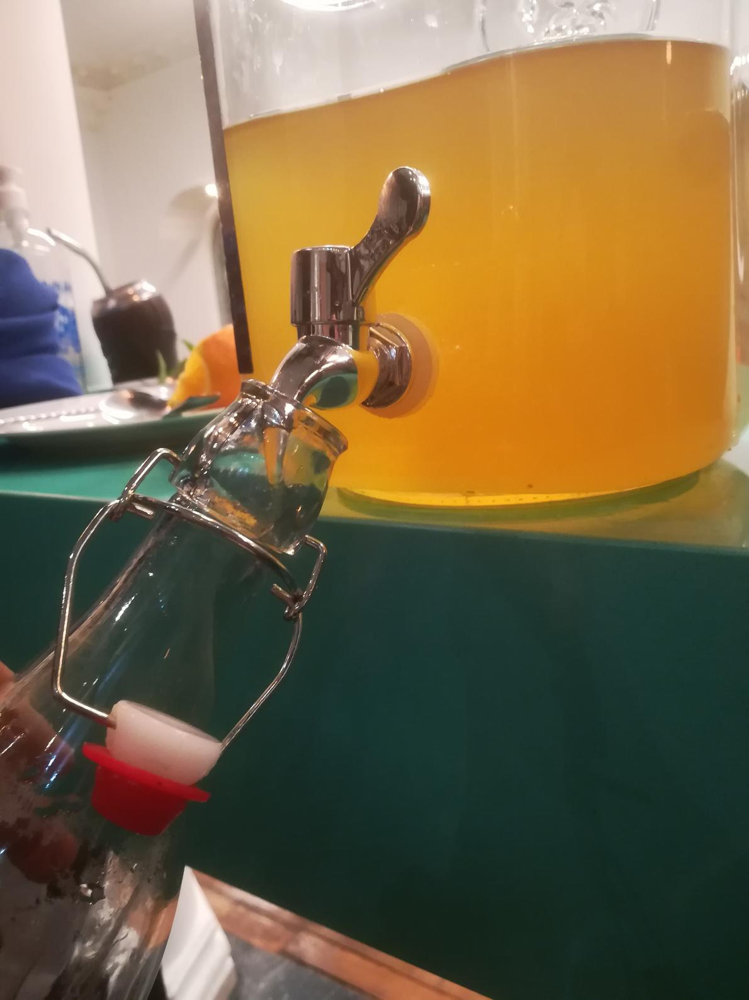

# Kombucha en el coliving

## ¿Qué es la kombucha?

La kombucha es una bebida fermentada. Los ingredientes principales son
té, azúcar, y un poco de kombucha como iniciador. Tiene un sabor
ácido, más o menos intenso dependiendo del tiempo de fermentación.

Una parte muy importante para la producción muy importante es el SCOBY
(o "eschoby" para les amigues) que llega a producir una película
gelatinosa en la superfície. `SCOBY` son las siglas de _**S**ymbiotic
**C**olony **O**f **B**acteria and **Y**east_ (colonia simbiótica de
bacterias y levaduras).

Esta colonia es la que se encarga de procesar los taninos del té, y el
azúcar, generando ácido acético (el del vinagre) y CO2
(importante para las burbujitas).

El nombre proviene del japonés de "kombu" (alga, por la forma que
toman las ramificaciones del SCOBY) y "cha" (té).

Esto es una breve introducción, hay mucha más información en
[wikipedia](https://es.wikipedia.org/wiki/Kombucha).

## ¿Por qué kombucha?

Hay distintas razones por las que te podría interesar hacer tu propia
kombucha, puedes elegir tantas como quieras:

* Tiene vitaminas
* Tiene un rico sabor
* Fermentar es _cool_
* La venden en varios lados, pero es cara
* No requiere grandes cuidados, se hace casi sola
* El coliving ya tiene los insumos necesarios
* Quieres experimentar con sabores distintos a los que venden

## Procedimiento

Para hacer kombucha en casa, como para cualquier fermentación, lo más
importante va a ser el tiempo. Que pase. Y pasa solo, así que no
tendrás que hacer mucho.

El tiempo de dedicación real es muy bajo, pero no puedes pretender
empezar hoy y mañana tener kombucha.

Vamos a aprovechar el embotellado de un batch previo, para preparar
uno nuevo.

Existen dos fases bien diferenciadas:

### Primera fermentación

En esta fermentación "en masa" vamos a convertir el té + azúcar en
kombucha "cruda" (_raw_ en inglés). La duración dependerá de la
temperatura ambiente y de qué nivel de acidez busquemos, pero en
general dura entre unos 7 y 20 días.

#### Preparar el té

Como está escrito más arriba, la kombucha es un fermento de té y
azúcar, así que para hacer kombucha vamos a necesitar... té y azúcar.

En el coliving hay un recipiente de 6.25L con canillita. Vamos a
preparar unos 5.5L de té, pero no vamos a calentar todo el agua. La
idea es calentar aproximadamente 1.5L (que podemos sacar del
dispensador), hacer el té, y después añadirle el resto de agua. De
esta forma, no vamos a tener que esperar tanto a que se enfríe.

##### Té
El té negro es el que mejor funciona, pero también se puede usar té
verde. La que tenemos funcionando en el coliving es con té negro.
Usaremos *un saquito de té* por litro de agua (o una cucharada sopera,
o unos 2-3 gramos).

##### Azúcar
El azúcar es importante que sea blanco, es el que más le gusta a la
levadura. La cantidad de azúcar que quedará va a ser muy baja así que
no debería de preocuparte. Usaremos entre unos *40 y unos 60 gramos*
de azúcar por litro de agua.

Queremos que se disuelva lo más posible, si el agua está caliente va a
ser más fácil.

##### Agua
Podemos usar la del dispensador de la cocina. La de la canilla podría
servir también, ahora que tenemos un SCOBY más maduro.

#### Añadir _iniciador_ y SCOBY

Pondremos el té en el recipiente donde vamos a fermentar, que debería
de estar vacío.

Una vez tengamos el té a una temperatura de entre 20ºC y 35ºC,
añadiremos la kombucha de la partida anterior que reservamos, junto
con el SCOBY.

Debemos cubrirlo con un paño, tela, o lo que tengamos a mano. Es
importante que esté limpio, y que no tenga agujeros demasiado
grandes. No queremos que se contamine el SCOBY. Puede producirse moho
si no es suficientemente ácido, o puede entrar moscas y depositar
huevos.

#### Fermentar

Esta es la parte más fácil. Necesitamos que pase el tiempo.  La
temperatura idónea es entre 22ºC y 32ºC. Es mejor si no le da la luz
del sol directamente.

En invierno un buen lugar es entre el dispensador y la heladera de la
cocina, ya que por el uso de los hornos y el estar más cerrado, en
general tiene una temperatura un poco más alta.

### Segunda fermentación

Esta fermentación es opcional, pero sirve para _carbonizar_ y
_saborizar_ la kombucha. Esta fermentación es en botella, y de vuelta,
depende de la temperatura ambiente y el sabor que busquemos, pero en
general dura entre unos 3 y 10 días.

Es recomendable que las botellas sean de cristal, tengan tapa
hermética y sean cilindrícas.

#### Saborización

En botellas vacías, podemos poner cortes de fruta, hojas de hierbas
aromáticas, lúpulo, ...

La cantidad va a depender del tamaño de la botella y de cuanto tiempo
vaya a fermentar, pero una buena técnica para la fruta es rellenar una
quinta parte del volumen de la botella.

También es recomendable añadirle una cucharadita de azúcar, así
alimentaremos las levaduras para que tengan una mejor fermentación y
ayude en la carbonización. Este azúcar, no lo consumiremos nosotros.

Algunas combinaciones sencillas:

* Naranja y romero
* Manzana (le da un sabor a sidra)
* Menta con jenjibre

Las opciones son infinas, aunque es recomendable no mezclar más de
tres sabores en una misma botella. La inspiración se puede encontrar
en botellas que venden en tiendas, o directamente en
[internet](https://www.culturesforhealth.com/learn/kombucha/flavoring-bottling-kombucha/).

#### Embotellado

Ahora que las botellas tienen los elementos que le van a dar sabor, ya
podemos añadirle kombucha.

Para ello, vamos a sacar el SCOBY del recipiente donde estuvo
fermentando.  Lo dejaremos en otro recipiente por unos minutos, con un
poco de kombucha.

Después es necesario remover el contenido del recipiente tenemos la
kombucha que vamos a embotellar, para que las levaduras se repartan
homogéneamente.

Vamos a reservarnos un poco de kombucha para la siguiente partida, y a
embotellar el resto.

Es importante dejar un espacio libre en la botella, y no llenar hasta
arriba del todo, para que tenga lugar para expandirse.

#### Carbonización

Las kombucha dentro de la botella va a seguir fermentando, gracias a
las levaduras.  Éstas van a consumir el azúcar, tanto el que añadimos
como el de la fruta, y van a producir CO2, que será
retenido por el cierre hermético de la botella.

Esto hará que eventualmente quede atrapado en la propia kombucha,
dándole esa efervescencia característica de los refrescos.

Es importante manipular con cuidado si hace mucho calor o fermentamos
por mucho tiempo, ya que, debido a la presión generada, puede llegar a
explotar o a salir todo el contenido disparado.

Por eso queremos una botella cilíndrica, para que la presión acumulada
se reparta en toda la superficíe.

Hay gente que cada un par de días abre la botella para _desgasificar_.

Una vez tenga la cantidad de gas deseada, podremos enfriarla y
servirla. ¡Salud!

## Otros recursos

### Videos

A veces un vídeo puede ser más explicativo que texto e imágenes:

* [Beginners Guide To Fermentation: Kombucha Making](https://www.youtube.com/watch?v=D3Axb37lMWI)
* [Quick Start Guide to Homemade Kombucha](https://www.youtube.com/watch?v=iP1L_u4kiNE)
